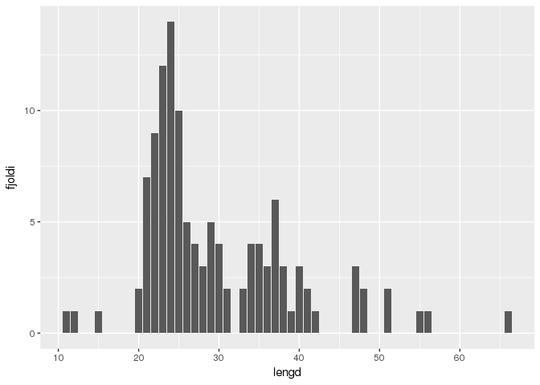
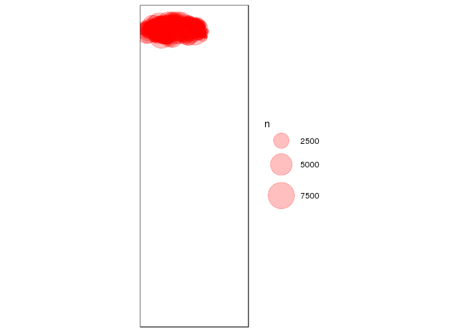
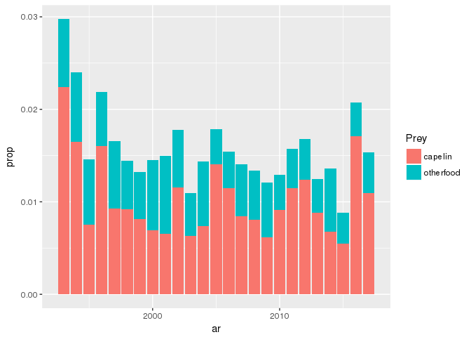

# mar
Bjarki Þór Elvarsson and Einar Hjörleifsson  


The small print: Package in the making

## Tidyverse connection to MRI oracle database

The [`dplyr`-package](https://cran.rstudio.com/web/packages/dplyr/vignettes/introduction.html) is designed so that, in addition to working with local R-data.frames, it works with remote on-disk data stored in databases. [Inbuilt functions within dplyr](https://cran.rstudio.com/web/packages/dplyr/vignettes/databases.html) allow seamless connectivity with sqlite, mysql and postgresql. Due to some idiosyncrasies associated with schema as well as issues related to case-sensitivity make "default" communication with Oracle not straight forward. These as well as other convenience wrappers are taken care of in the `mar`-packages.

### Installation

You have to do this once, or when you want to update the packages already installed on your computer:


```r
install.packages("tidyverse")
install.packages("devtools")
devtools::install_github("tidyverse/dbplyr")
devtools::install_github("fishvice/mar",  dependencies = FALSE)
```

Windows users may encounter issues when installing the mar - package related to different binary modes (32 bit vs 64 bit) where the user is prompted with the following error 

> ERROR: loading failed for 'i386'

This issue can be bypassed by installing mar using: 

```r
devtools::install_github("fishvice/mar",  dependencies = FALSE, args='--no-multiarch')
```


### Establish connection


```r
library(tidyverse)
library(ROracle)
library(mar)
```

Connection to MRI Oracle database:

```r
mar <- dbConnect(dbDriver('Oracle'))
```

### Some (hopefully) gentle introduction
___

The core function in the `mar`-package is the `tbl-mar`-function. It takes two arguments, the "connection" and the name of the oracle table. E.g. to establish a connection to the table "lengdir" in the schema "fiskar" one can do:

```r
lengdir <- tbl_mar(mar, "fiskar.lengdir")
```
What class is lengdir?:

```r
class(lengdir)
```

```
## [1] "tbl_dbi"  "tbl_sql"  "tbl_lazy" "tbl"
```
The class here is somewhat obtuse. Lets not worry about that to much. What has happened behind the scene one can realize by:

```r
show_query(lengdir) 
```
Ergo we generated an object, which one part is an SQL-query. The `show_query` informs us how the database plans to execute the query.

The operation has not yet touched the database. It’s not until you ask for the data (e.g. by printing lengdir) that dplyr generates the SQL and requests the results from the database. Even then it only pulls down 10 rows.

```r
lengdir
```

```
## # Source:   lazy query [?? x 10]
## # Database: OraConnection
##    synis_id tegund lengd fjoldi   kyn kynthroski                 sbt
##       <int>  <int> <dbl>  <int> <int>      <int>              <dttm>
##  1    48208      1    38      3    NA         NA 1996-08-21 01:00:23
##  2    48208      1    43      2    NA         NA 1996-08-21 01:00:23
##  3    48200      1    13      2    NA         NA 1996-08-21 01:00:23
##  4    48200      1    38      1    NA         NA 1996-08-21 01:00:23
##  5    48200      1    43      1    NA         NA 1996-08-21 01:00:23
##  6    50603     28    23      1    NA         NA 1996-08-21 01:00:14
##  7    50603     28    35      1    NA         NA 1996-08-21 01:00:14
##  8    50604     28    20      2    NA         NA 1996-08-21 01:00:14
##  9    50604     28    21      2    NA         NA 1996-08-21 01:00:14
## 10    50604     28    22      5    NA         NA 1996-08-21 01:00:14
## # ... with more rows, and 3 more variables: sbn <chr>, snt <dttm>,
## #   snn <chr>
```
Now, there are columns returned that we have little interest in (sbt:snn). Using the `dplyr`-verbs (functions) one can easily build upon the base query, e.g.:

```r
lengdir %>% 
  select(synis_id, tegund, lengd, fjoldi, kyn, kynthroski) %>% 
  glimpse()
```

```
## Observations: 25
## Variables: 6
## $ synis_id   <int> 48208, 48208, 48200, 48200, 48200, 50603, 50603, 50...
## $ tegund     <int> 1, 1, 1, 1, 1, 28, 28, 28, 28, 28, 28, 28, 28, 28, ...
## $ lengd      <dbl> 38, 43, 13, 38, 43, 23, 35, 20, 21, 22, 24, 25, 26,...
## $ fjoldi     <int> 3, 2, 2, 1, 1, 1, 1, 2, 2, 5, 4, 8, 5, 2, 3, 7, 5, ...
## $ kyn        <int> NA, NA, NA, NA, NA, NA, NA, NA, NA, NA, NA, NA, NA,...
## $ kynthroski <int> NA, NA, NA, NA, NA, NA, NA, NA, NA, NA, NA, NA, NA,...
```

Now if one were only interested in one species and one station we may extend the above as:

```r
lengdir <- 
  tbl_mar(mar, "fiskar.lengdir") %>% 
  select(synis_id, tegund, lengd, fjoldi, kyn, kynthroski) %>% 
  filter(synis_id == 48489,
         tegund == 1)
show_query(lengdir)
```

To pull down all the results into R one uses collect(), which returns a tidyverse data.frame (tbl_df):

```r
d <- 
  lengdir %>% 
  collect()
class(d)
```

```
## [1] "tbl_df"     "tbl"        "data.frame"
```

```r
dim(d)
```

```
## [1] 31  6
```

A quick visualization of the data can be obtained via:

```r
library(ggplot2)
d %>% 
  ggplot() +
  geom_bar(aes(lengd, fjoldi), stat = "identity")
```

<!-- -->

So we have the length distribution of measured cod from one sample (station). We do not however know what this sample is, because the column **synis_id** is just some gibberish automatically generated within Oracle. Before we deal with that, lets introduce `lesa_lengdir`-function that resides in the `mar`-package:


```r
lesa_lengdir(mar) %>% glimpse()
```

```
## Observations: 25
## Variables: 6
## $ synis_id   <int> 48208, 48208, 48200, 48200, 48200, 50603, 50603, 50...
## $ tegund     <int> 1, 1, 1, 1, 1, 28, 28, 28, 28, 28, 28, 28, 28, 28, ...
## $ lengd      <dbl> 38, 43, 13, 38, 43, 23, 35, 20, 21, 22, 24, 25, 26,...
## $ fjoldi     <int> 3, 2, 2, 1, 1, 1, 1, 2, 2, 5, 4, 8, 5, 2, 3, 7, 5, ...
## $ kyn        <int> NA, NA, NA, NA, NA, NA, NA, NA, NA, NA, NA, NA, NA,...
## $ kynthroski <int> NA, NA, NA, NA, NA, NA, NA, NA, NA, NA, NA, NA, NA,...
```

Here we have same columns as above with one additional column, **uppruni_lengdir**. This is because the function reads from two different tables, **fiskar.lengdir** and **fiskar.leidr_lengdir** and combines them into one. Hopefully this is only an interim measure - there are plans to merge these two data tables into one (lets keep our fingers crossed). 

Lets used `lesa_lengdir` as our starting point, this time lets ask the question how many fish by species were length measured from this yet unknown station:

```r
d <-
  lesa_lengdir(mar) %>% 
  filter(synis_id == 48489) %>% 
  group_by(tegund) %>% 
  summarise(fjoldi = sum(fjoldi)) %>% 
  arrange(fjoldi)
#explain(d)
```

The SQL query has now become a bunch of gibberish for some of us. But this demonstrates that in addition to **select** and **filter** the `dplyr`-verbs **group_by**, **summarise** and **arrange** are "translated" into SQL :-) To see the outcome we do:

```r
d %>% collect()
```

```
## # A tibble: 7 x 2
##   tegund fjoldi
##    <int>  <dbl>
## 1      2      1
## 2     25      6
## 3     22      6
## 4      5     39
## 5     12     49
## 6     28     60
## 7      1    119
```

Those familiar with the fiskar database know that these information are also available in the table **numer**. Here we can use the ``mar::lesa_numer` function:

```r
lesa_numer(mar) %>% 
  filter(synis_id == 48489)
```

```
## # Source:   lazy query [?? x 19]
## # Database: OraConnection
##    synis_id tegund fj_maelt fj_kvarnad gamalt_lnr gamalt_knr fj_talid
##       <int>  <int>    <int>      <int>      <int>      <int>    <int>
##  1    48489      1      119         56        209        209        0
##  2    48489      2        1          1        208        208        0
##  3    48489      5       39          0        209         NA        0
##  4    48489     12       49          0        209         NA        0
##  5    48489     22        6          0        202         NA        0
##  6    48489     25        6          0        203         NA        0
##  7    48489     28       60          0        209         NA        0
##  8    48489     30        0          0         NA         NA       11
##  9    48489     53        0          0         NA         NA        1
## 10    48489     56        0          0         NA         NA        2
## # ... with more rows, and 12 more variables: afli <dbl>,
## #   fj_kyngreint <int>, fj_vigtad <int>, vigt_synis <dbl>,
## #   fj_magasyna <int>, aths_numer <chr>, status_lengdir <int>,
## #   status_kvarnir <int>, fj_merkt <int>, fj_aldursgr <int>,
## #   kg_talning <int>, uppruni_numer <chr>
```


```r
tbl_mar(mar, "fiskar.numer") %>% 
  filter(synis_id == 48489) %>% 
  select(tegund, fj_maelt, fj_talid) %>% 
  arrange(fj_maelt) %>% 
  collect()
```

```
## # A tibble: 11 x 3
##    tegund fj_maelt fj_talid
##     <int>    <int>    <int>
##  1     85        0      123
##  2     53        0        1
##  3     30        0       11
##  4     56        0        2
##  5      2        1        0
##  6     22        6        0
##  7     25        6        0
##  8      5       39        0
##  9     12       49        0
## 10     28       60        0
## 11      1      119        0
```

So we get a dataframe that has more species than those obtained from `lesa_lengdir`. This is because the sample (station) also contained some species that were not measured, only counted.

Information about the station that corresponds to synis_id = 48489 reside in the station table:

```r
lesa_stodvar(mar) %>% 
  filter(synis_id == 48489) %>% 
  glimpse()
```

```
## Observations: 1
## Variables: 64
## $ synis_id         <int> 48489
## $ leidangur        <chr> "TA1-91"
## $ dags             <dttm> 1991-03-06
## $ skip             <int> 1307
## $ ar               <dbl> 1991
## $ man              <dbl> 3
## $ stod             <int> 9
## $ reitur           <dbl> 669
## $ smareitur        <dbl> 4
## $ kastad_n_breidd  <dbl> 66.50917
## $ kastad_v_lengd   <dbl> -19.39383
## $ hift_n_breidd    <dbl> 66.5575
## $ hift_v_lengd     <dbl> -19.37867
## $ dypi_kastad      <int> 311
## $ dypi_hift        <int> 311
## $ veidarfaeri      <int> 73
## $ moskvastaerd     <int> 40
## $ grandarlengd     <int> 45
## $ heildarafli      <int> NA
## $ londunarhofn     <int> NA
## $ skiki            <int> NA
## $ fjardarreitur    <int> NA
## $ hnattstada       <int> -1
## $ landsyni         <int> 0
## $ aths_stodvar     <chr> NA
## $ stada_stodvar    <int> NA
## $ net_nr           <int> NA
## $ synaflokkur      <int> 30
## $ veidisvaedi      <chr> NA
## $ hitamaelir_id    <dbl> NA
## $ maelingarmenn    <chr> NA
## $ veidarfaeri_id   <dbl> NA
## $ tog_aths         <chr> NA
## $ medferd_afla     <int> NA
## $ togbyrjun        <dttm> 1991-03-06 17:12:00
## $ togendir         <dttm> 1991-03-06 18:03:00
## $ toghradi         <dbl> 3.5
## $ toglengd         <dbl> 3
## $ vir_uti          <int> 375
## $ lodrett_opnun    <dbl> 2.2
## $ tognumer         <int> 11
## $ togstefna        <int> 15
## $ larett_opnun     <dbl> NA
## $ togtimi          <int> 51
## $ togdypi_kastad   <int> NA
## $ togdypi_hift     <int> NA
## $ togdypishiti     <dbl> NA
## $ eykt             <int> NA
## $ tog_lengd        <dbl> NA
## $ dregid_fra       <chr> NA
## $ vindhradi        <int> 5
## $ vindatt          <int> 5
## $ vedur            <int> 1
## $ sky              <int> 7
## $ sjor             <int> 2
## $ botnhiti         <dbl> 4
## $ yfirbordshiti    <dbl> 3.5
## $ lofthiti         <dbl> 2.5
## $ loftvog          <int> 1006
## $ hafis            <int> 0
## $ straumstefna     <int> NA
## $ straumhradi      <dbl> NA
## $ sjondypi         <int> NA
## $ vindhradi_hnutar <int> 9
```

For those familiar with what is stored in **fiskar.stodvar** recognize that the station is most likely part of the 1991 spring survey (veidarfaeri = 73 and synaflokkur = 30 provides the best hint). What if we were to start from this end and get all the stations from the 1991 survey and also limit the number of columns returned:

```r
smb1991 <-
  lesa_stodvar(mar) %>% 
  filter(ar == 1991,
         veidarfaeri == 73,
         synaflokkur == 30) %>% 
  select(synis_id,
         lon = kastad_v_lengd,
         lat = kastad_n_breidd)
```

To get a quick plot of the station location we could do:

```r
smb1991 %>% 
  collect() %>% 
  ggplot(aes(lon, lat)) +
  geom_polygon(data = gisland::iceland, aes(long, lat, group = group)) +
  geom_point(col = "red") +
  coord_quickmap()
```

<!-- -->

Looks about right. But what if we were interested in getting the total number of fish recorded at each station? Here we need to obtain the information from **fiskar.numer** for the station (synis_id) in question. This we do by using `left_join`:

```r
nu <- 
  tbl_mar(mar, "fiskar.numer") %>% 
  group_by(synis_id) %>% 
  summarise(n = sum(fj_maelt + fj_talid))
smb1991_n <-
  smb1991 %>% 
  left_join(nu)
```

Again we have not done much more than generate an SQL-query and not touched the database. For those interested seeing the SQL-code do:

```r
show_query(smb1991_n)
```

To turn this into action, lets execute the query, get the dataframe into R and plot the data:

```r
smb1991_n %>% 
  collect() %>% 
  ggplot() +
  theme_bw() +
  geom_polygon(data = gisland::iceland, aes(long, lat, group = group), fill = "grey") +
  geom_point(aes(lon, lat, size = n), col = "red", alpha = 0.25) +
  scale_size_area(max_size = 15) +
  scale_x_continuous(NULL, NULL) +
  scale_y_continuous(NULL, NULL) +
  coord_quickmap()
```

<!-- -->


### Metadata

List of tables available to the user:

```r
mar_tables(mar,schema = 'fiskar')
```

```
## # Source:   lazy query [?? x 7]
## # Database: OraConnection
##     owner        table_name tablespace_name num_rows       last_analyzed
##     <chr>             <chr>           <chr>    <dbl>              <dttm>
##  1 FISKAR            REITIR             NYT     2864 2017-10-12 22:00:15
##  2 FISKAR       KVARNALOGUN             NYT      107 2017-10-12 22:00:15
##  3 FISKAR             BEITA             NYT        2 2017-06-28 11:32:50
##  4 FISKAR           FLOKKAR             NYT        0 2017-06-28 11:35:33
##  5 FISKAR FLOKKAR_SENDINGAR             NYT    13527 2017-06-28 11:35:33
##  6 FISKAR         G_TROSSUR             NYT      222 2017-06-28 11:47:35
##  7 FISKAR         G_VIKMORK             NYT      253 2017-06-28 11:47:36
##  8 FISKAR             HAFIS             NYT       10 2017-06-28 11:47:42
##  9 FISKAR     ICES_TEGUNDIR             NYT       21 2017-06-28 11:48:32
## 10 FISKAR   INNSLATT_STATUS             NYT       17 2017-06-28 11:48:50
## # ... with more rows, and 2 more variables: table_type <chr>,
## #   comments <chr>
```

Description of the columns of a particular table:


```r
mar_fields(mar,'fiskar.stodvar')
```

```
## # Source:   lazy query [?? x 4]
## # Database: OraConnection
##     owner table_name     column_name
##     <chr>      <chr>           <chr>
##  1 fiskar    stodvar        synis_id
##  2 fiskar    stodvar       leidangur
##  3 fiskar    stodvar            dags
##  4 fiskar    stodvar            skip
##  5 fiskar    stodvar            stod
##  6 fiskar    stodvar          reitur
##  7 fiskar    stodvar       smareitur
##  8 fiskar    stodvar kastad_n_breidd
##  9 fiskar    stodvar  kastad_v_lengd
## 10 fiskar    stodvar   hift_n_breidd
## # ... with more rows, and 1 more variables: comments <chr>
```


### Something else (more advanced)
____

... pending

### Working with stomach data
____

Let's look at stomach samples. Restrict our analysis to fish from the spring survey after 1992.


```r
st <- 
  lesa_stodvar(mar) %>% 
  filter(synaflokkur == 30, ar > 1992) %>% 
  select(synis_id,ar)
```
  
and only look at stomachs from cods between 40 and 80 fish


```r
tmp <- 
  faeda_ranfiskar(mar) %>% 
  filter(lengd %in% 40:80,ranfiskur == 1) %>% 
  mutate(weight = 0.01*lengd^3) %>% 
  right_join(st) %>% 
  left_join(faeda_thyngdir(mar)) %>% 
  mutate(faeduhopur = nvl(faeduhopur,'Empty'),
         thyngd = nvl(thyngd,0))
```

Look at the average percentage of body weight capelin in the stomach is in the spring survey compared to other species

```r
tmp %>% 
  left_join(tmp %>% 
              group_by(flokk_id) %>% 
              summarise(total = sum(thyngd))) %>% 
  select(ar,flokk_id,faeduhopur,thyngd,total,weight) %>% 
  group_by(ar,flokk_id,faeduhopur,weight) %>%  ## why do we have duplicate prey entries?
  summarise(thyngd=sum(thyngd),total=sum(total)) %>% 
  collect(n=Inf) %>% 
  ungroup() %>% 
  spread(faeduhopur,thyngd,fill=0) %>% ## this function should be availabe in the database
  select(ar,flokk_id,weight,capelin=`mall vil`,total) %>% 
  mutate(otherfood = (total - capelin)/weight,
         capelin = capelin/weight) %>%  
  select(ar,capelin,otherfood) %>% 
  gather(Prey,prop,-ar) %>% 
  group_by(ar,Prey) %>% 
  summarise(prop=mean(prop,na.rm=TRUE)) %>% 
  ggplot(aes(ar,prop,fill=Prey)) + geom_bar(stat = 'identity')
```

<!-- -->


```r
devtools::session_info()
```

```
##  setting  value                       
##  version  R version 3.4.1 (2017-06-30)
##  system   x86_64, linux-gnu           
##  ui       X11                         
##  language (EN)                        
##  collate  en_US.UTF-8                 
##  tz       Atlantic/Reykjavik          
##  date     2017-11-08                  
## 
##  package    * version    date      
##  assertthat   0.2.0      2017-04-11
##  backports    1.1.1      2017-09-25
##  base       * 3.4.1      2017-06-30
##  bindr        0.1        2016-11-13
##  bindrcpp   * 0.2        2017-06-17
##  broom        0.4.2      2017-02-13
##  cellranger   1.1.0      2016-07-27
##  colorspace   1.3-2      2016-12-14
##  compiler     3.4.1      2017-06-30
##  data.table   1.10.4-3   2017-10-27
##  datasets   * 3.4.1      2017-06-30
##  DBI        * 0.7        2017-06-18
##  dbplyr       1.1.0.9000 2017-10-25
##  devtools     1.13.3     2017-08-02
##  digest       0.6.12     2017-01-27
##  dplyr      * 0.7.4      2017-09-28
##  evaluate     0.10.1     2017-06-24
##  forcats      0.2.0      2017-01-23
##  foreign      0.8-69     2017-06-21
##  ggplot2    * 2.2.1.9000 2017-11-03
##  gisland      0.0.07     2017-11-03
##  glue         1.1.1      2017-06-21
##  graphics   * 3.4.1      2017-06-30
##  grDevices  * 3.4.1      2017-06-30
##  grid         3.4.1      2017-06-30
##  gtable       0.2.0      2016-02-26
##  haven        1.1.0      2017-07-09
##  hms          0.3        2016-11-22
##  htmltools    0.3.6      2017-04-28
##  httr         1.3.1      2017-08-20
##  jsonlite     1.5        2017-06-01
##  knitr        1.17       2017-08-10
##  labeling     0.3        2014-08-23
##  lattice      0.20-35    2017-03-25
##  lazyeval     0.2.1      2017-10-29
##  lubridate    1.6.0      2016-09-13
##  magrittr     1.5        2014-11-22
##  mar        * 0.0.3.9000 2017-11-07
##  memoise      1.1.0      2017-04-21
##  methods    * 3.4.1      2017-06-30
##  mnormt       1.5-5      2016-10-15
##  modelr       0.1.1      2017-07-24
##  munsell      0.4.3      2016-02-13
##  nlme         3.1-131    2017-02-06
##  parallel     3.4.1      2017-06-30
##  pkgconfig    2.0.1      2017-03-21
##  plyr         1.8.4      2016-06-08
##  psych        1.7.8      2017-09-09
##  purrr      * 0.2.4      2017-10-18
##  R6           2.2.2      2017-06-17
##  Rcpp         0.12.13    2017-09-28
##  readr      * 1.1.1      2017-05-16
##  readxl       1.0.0      2017-04-18
##  reshape2     1.4.2      2016-10-22
##  rlang        0.1.2.9000 2017-11-03
##  rmarkdown    1.6        2017-06-15
##  ROracle    * 1.3-1      2016-10-26
##  rprojroot    1.2        2017-01-16
##  rvest        0.3.2      2016-06-17
##  scales       0.5.0.9000 2017-11-03
##  sp         * 1.2-5      2017-06-29
##  stats      * 3.4.1      2017-06-30
##  stringi      1.1.5      2017-04-07
##  stringr      1.2.0      2017-02-18
##  tibble     * 1.3.4      2017-08-22
##  tidyr      * 0.7.2      2017-10-16
##  tidyselect   0.2.2      2017-10-10
##  tidyverse  * 1.1.1      2017-01-27
##  tools        3.4.1      2017-06-30
##  utils      * 3.4.1      2017-06-30
##  withr        2.1.0.9000 2017-11-03
##  xml2         1.1.1      2017-01-24
##  yaml         2.1.14     2016-11-12
##  source                                    
##  CRAN (R 3.4.0)                            
##  CRAN (R 3.4.1)                            
##  local                                     
##  CRAN (R 3.4.0)                            
##  CRAN (R 3.4.0)                            
##  CRAN (R 3.4.0)                            
##  CRAN (R 3.4.0)                            
##  CRAN (R 3.4.0)                            
##  local                                     
##  cran (@1.10.4-)                           
##  local                                     
##  CRAN (R 3.4.0)                            
##  Github (tidyverse/dbplyr@a71e0d6)         
##  CRAN (R 3.4.1)                            
##  CRAN (R 3.4.1)                            
##  CRAN (R 3.4.1)                            
##  CRAN (R 3.4.1)                            
##  CRAN (R 3.4.0)                            
##  CRAN (R 3.4.1)                            
##  Github (tidyverse/ggplot2@9979112)        
##  Github (einarhjorleifsson/gisland@e15c0ad)
##  cran (@1.1.1)                             
##  local                                     
##  local                                     
##  local                                     
##  CRAN (R 3.4.0)                            
##  CRAN (R 3.4.1)                            
##  CRAN (R 3.4.0)                            
##  CRAN (R 3.4.0)                            
##  CRAN (R 3.4.1)                            
##  CRAN (R 3.4.0)                            
##  CRAN (R 3.4.1)                            
##  CRAN (R 3.4.0)                            
##  CRAN (R 3.4.0)                            
##  cran (@0.2.1)                             
##  CRAN (R 3.4.0)                            
##  CRAN (R 3.4.0)                            
##  local                                     
##  CRAN (R 3.4.0)                            
##  local                                     
##  CRAN (R 3.4.0)                            
##  CRAN (R 3.4.1)                            
##  CRAN (R 3.4.0)                            
##  CRAN (R 3.4.0)                            
##  local                                     
##  CRAN (R 3.4.0)                            
##  CRAN (R 3.4.0)                            
##  CRAN (R 3.4.1)                            
##  CRAN (R 3.4.1)                            
##  CRAN (R 3.4.0)                            
##  CRAN (R 3.4.1)                            
##  CRAN (R 3.4.0)                            
##  CRAN (R 3.4.0)                            
##  CRAN (R 3.4.0)                            
##  Github (tidyverse/rlang@bf67fd5)          
##  CRAN (R 3.4.0)                            
##  CRAN (R 3.4.0)                            
##  CRAN (R 3.4.0)                            
##  CRAN (R 3.4.0)                            
##  Github (hadley/scales@d767915)            
##  CRAN (R 3.4.1)                            
##  local                                     
##  CRAN (R 3.4.0)                            
##  CRAN (R 3.4.0)                            
##  CRAN (R 3.4.1)                            
##  CRAN (R 3.4.1)                            
##  CRAN (R 3.4.1)                            
##  CRAN (R 3.4.0)                            
##  local                                     
##  local                                     
##  Github (jimhester/withr@8ba5e46)          
##  CRAN (R 3.4.0)                            
##  CRAN (R 3.4.0)
```
