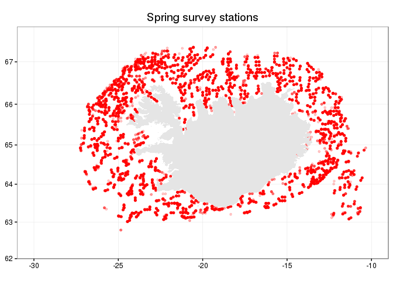
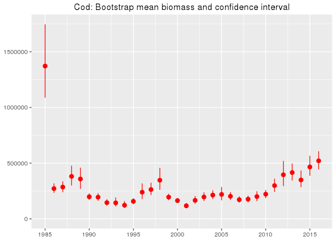
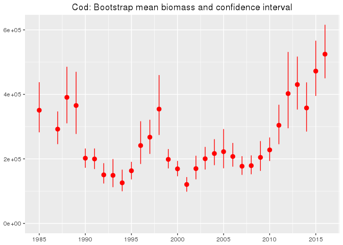

# mar

## dplyr-erized connection to MRI oracle database


```r
# devtools::install_github("bernardocaldas/dplyrOracle")
# devtools::install_github("fishvice/mar")
library(ggplot2)
library(mar)
library(dplyr)
library(dplyrOracle)
mar <- src_oracle("mar")
st <-
  lesa_stodvar(mar) %>%
  filter(ar %in% c(1985:2016),
         veidarfaeri == 73,
         synaflokkur == 30,
         tognumer < 40)
```


```r
glimpse(st)
```

```
## Observations: NA
## Variables: 64
## $ vindhradi_hnutar (int) 30, 30, 30, 30, 24, 18, 18, 13, 13, 9, 9, 5, ...
## $ sjondypi         (int) NA, NA, NA, NA, NA, NA, NA, NA, NA, NA, NA, N...
## $ straumhradi      (dbl) NA, NA, NA, NA, NA, NA, NA, NA, NA, NA, NA, N...
## $ straumstefna     (int) NA, NA, NA, NA, NA, NA, NA, NA, NA, NA, NA, N...
## $ hafis            (int) 0, 0, 0, 0, 0, 0, 0, 0, 0, 0, 0, 0, 0, 0, 0, ...
## $ loftvog          (int) 992, 982, 982, NA, 984, 986, 986, 986, 986, 9...
## $ lofthiti         (dbl) -4.5, -4.5, NA, -2.0, -1.3, 0.0, 0.1, 0.2, 0....
## $ yfirbordshiti    (dbl) 1.1, 1.1, 1.0, 1.1, 0.9, 1.3, 1.2, 1.2, 1.1, ...
## $ botnhiti         (dbl) NA, 1.0, NA, 1.0, 1.1, 1.0, -0.5, 0.9, 0.9, 0...
## $ sjor             (int) 4, 4, 5, 5, 4, 4, 4, 3, 3, 2, 2, 2, 3, 3, 2, ...
## $ sky              (int) 9, 9, 8, 7, 7, 7, 7, 9, 9, 9, 9, 7, 7, 7, 8, ...
## $ vedur            (int) 2, 2, 2, 7, 7, 1, 1, 1, 1, 1, 1, 2, 7, 7, 7, ...
## $ vindatt          (int) 5, 5, 5, 9, 9, 9, 9, 9, 9, 14, 14, 5, 5, 5, 3...
## $ vindhradi        (int) 15, 15, 15, 15, 12, 9, 9, 7, 7, 5, 5, 3, 7, 7...
## $ dregid_fra       (chr) NA, NA, NA, NA, NA, NA, NA, NA, NA, NA, NA, N...
## $ tog_lengd        (dbl) NA, NA, NA, NA, NA, NA, NA, NA, NA, NA, NA, N...
## $ eykt             (int) NA, NA, NA, NA, NA, NA, NA, NA, NA, NA, NA, N...
## $ togdypishiti     (dbl) NA, NA, NA, NA, NA, NA, NA, NA, NA, NA, NA, N...
## $ togdypi_hift     (int) NA, NA, NA, NA, NA, NA, NA, NA, NA, NA, NA, N...
## $ togdypi_kastad   (int) NA, NA, NA, NA, NA, NA, NA, NA, NA, NA, NA, N...
## $ togtimi          (dbl) 60, 63, 74, 60, 59, 59, 61, 64, 62, 62, 60, 5...
## $ larett_opnun     (dbl) NA, NA, NA, NA, NA, NA, NA, NA, NA, NA, NA, N...
## $ togstefna        (int) 355, 360, 55, 53, 360, 327, 55, 70, 220, 230,...
## $ tognumer         (dbl) 15, 13, 12, 1, 2, 1, 11, 13, 12, 14, 3, 11, 4...
## $ lodrett_opnun    (dbl) 2.0, 3.0, 2.4, 2.6, NA, NA, NA, 2.2, 2.0, 2.0...
## $ vir_uti          (int) 375, 375, 375, 150, 250, 375, 450, 325, 350, ...
## $ toglengd         (dbl) 4, 4, 4, 4, 4, 4, 4, 4, 4, 4, 4, 4, 4, 4, 4, ...
## $ toghradi         (dbl) 4.0, 3.8, 3.2, 4.0, 4.1, 4.1, 3.9, 3.8, 3.9, ...
## $ togendir         (time) 1990-03-16 06:05:00, 1990-03-16 08:51:00, 19...
## $ togbyrjun        (time) 1990-03-16 05:05:00, 1990-03-16 07:48:00, 19...
## $ medferd_afla     (int) NA, NA, NA, NA, NA, NA, NA, NA, NA, NA, NA, N...
## $ tog_aths         (chr) NA, NA, NA, NA, NA, NA, NA, NA, NA, NA, NA, N...
## $ veidarfaeri_id   (dbl) NA, NA, NA, NA, NA, NA, NA, NA, NA, NA, NA, N...
## $ maelingarmenn    (chr) NA, NA, NA, NA, NA, NA, NA, NA, NA, NA, NA, N...
## $ hitamaelir_id    (dbl) NA, NA, NA, NA, NA, NA, NA, NA, NA, NA, NA, N...
## $ veidisvaedi      (chr) NA, NA, NA, NA, NA, NA, NA, NA, NA, NA, NA, N...
## $ synaflokkur      (dbl) 30, 30, 30, 30, 30, 30, 30, 30, 30, 30, 30, 3...
## $ net_nr           (int) NA, NA, NA, NA, NA, NA, NA, NA, NA, NA, NA, N...
## $ stada_stodvar    (int) NA, NA, NA, NA, NA, NA, NA, NA, NA, NA, NA, N...
## $ aths             (chr) NA, NA, NA, NA, NA, NA, NA, NA, NA, NA, NA, N...
## $ landsyni         (dbl) 0, 0, 0, 0, 0, 0, 0, 0, 0, 0, 0, 0, 0, 0, 0, ...
## $ hnattstada       (int) -1, -1, -1, -1, -1, -1, -1, -1, -1, -1, -1, -...
## $ fjardarreitur    (int) NA, NA, NA, NA, NA, NA, NA, NA, NA, NA, NA, N...
## $ skiki            (int) NA, NA, NA, NA, NA, NA, NA, NA, NA, NA, NA, N...
## $ londunarhofn     (int) NA, NA, NA, NA, NA, NA, NA, NA, NA, NA, NA, N...
## $ heildarafli      (int) NA, NA, NA, NA, NA, NA, NA, NA, NA, NA, NA, N...
## $ grandaralengd    (int) 45, 45, 45, 45, 45, 45, 45, 45, 45, 45, 45, 4...
## $ moskvastaerd     (int) 40, 40, 40, 40, 40, 40, 40, 40, 40, 40, 40, 4...
## $ veidarfaeri      (int) 73, 73, 73, 73, 73, 73, 73, 73, 73, 73, 73, 7...
## $ dypi_hift        (int) 330, 314, 291, 117, 172, 307, 360, 256, 282, ...
## $ dypi_kastad      (int) 297, 302, 205, 88, 129, 249, 332, 244, 291, 2...
## $ hift_v_lengd     (int) 204390, 203201, 201745, 200465, 195933, 20453...
## $ hift_n_breidd    (int) 663550, 663455, 663693, 663696, 664343, 67179...
## $ kastad_v_lengd   (int) 204222, 202986, 202679, 201290, 195946, 20395...
## $ kastad_n_breidd  (int) 663135, 663055, 663515, 663445, 663946, 67145...
## $ smareitur        (int) 3, 4, 4, 4, 4, 1, 1, 4, 4, 4, 3, 4, 4, 1, 2, ...
## $ reitur           (int) 670, 670, 670, 670, 670, 720, 720, 720, 720, ...
## $ stod             (int) 72, 73, 74, 75, 76, 79, 80, 81, 82, 83, 84, 8...
## $ skip             (int) 1307, 1307, 1307, 1307, 1307, 1307, 1307, 130...
## $ dags             (time) 1990-03-16, 1990-03-16, 1990-03-16, 1990-03-...
## $ leidangur        (chr) "TA1-90", "TA1-90", "TA1-90", "TA1-90", "TA1-...
## $ synis_id         (int) 44929, 44928, 44927, 44926, 44925, 44922, 449...
## $ ar               (dbl) 1990, 1990, 1990, 1990, 1990, 1990, 1990, 199...
## $ man              (dbl) 3, 3, 3, 3, 3, 3, 3, 3, 3, 3, 3, 3, 3, 3, 3, ...
```


```r
st %>% 
  collect() %>% 
  mutate(lon1 = -gisland::geo_convert(kastad_v_lengd),
         lat1 =  gisland::geo_convert(kastad_n_breidd)) %>% 
  ggplot() +
  theme_bw() +
  geom_point(aes(lon1,lat1),alpha=0.2, size=1, col="red") +
  geom_polygon(data=gisland::iceland,aes(long,lat,group=group),fill="grey90") +
  coord_map(ylim=c(62,67.8), xlim=c(-31,-9)) +
  labs(x = NULL,y = NULL, title = "Spring survey stations")
```




```r
cod <-
  lesa_stodvar(mar) %>%
  filter(ar %in% c(1985:2016),
         veidarfaeri == 73,
         synaflokkur == 30,
         tognumer < 40) %>% 
  select(synis_id, ar) %>% 
  left_join(lesa_lengdir(mar) %>%
               filter(tegund %in% 1),
            by = "synis_id") %>%
  left_join(lesa_numer(mar) %>%
              filter(tegund %in% 1) %>% 
              select(synis_id, fj_talid, fj_maelt),
            by = "synis_id") %>% 
  collect(n = 1e7) # should be allowed to pass n = -1, but returns an error
```

```
## Joining by: "SYNIS_ID"
## Joining by: "SYNIS_ID"
```

```r
glimpse(cod)
```

```
## Observations: 618,860
## Variables: 9
## $ synis_id   (int) 44929, 44929, 44929, 44929, 44929, 44929, 44929, 44...
## $ ar         (dbl) 1990, 1990, 1990, 1990, 1990, 1990, 1990, 1990, 199...
## $ kynthroski (int) NA, NA, NA, NA, NA, NA, NA, NA, NA, NA, NA, NA, NA,...
## $ kyn        (int) NA, NA, NA, NA, NA, NA, NA, NA, NA, NA, NA, NA, NA,...
## $ fjoldi     (int) 12, 14, 20, 13, 1, 5, 1, 2, 5, 1, 1, 1, 1, 5, 1, 2,...
## $ lengd      (dbl) 21, 24, 25, 26, 28, 29, 30, 31, 38, 54, 63, 70, 10,...
## $ tegund     (int) 1, 1, 1, 1, 1, 1, 1, 1, 1, 1, 1, 1, 1, 1, 1, 1, 1, ...
## $ fj_talid   (int) 0, 0, 0, 0, 0, 0, 0, 0, 0, 0, 0, 0, 0, 0, 0, 0, 0, ...
## $ fj_maelt   (dbl) 155, 155, 155, 155, 155, 155, 155, 155, 155, 155, 1...
```

```r
cod %>% 
  mutate(r = (1 + fj_talid/fj_maelt),
         fjoldi = r * fjoldi,
         fjoldi = ifelse(is.na(fjoldi),0,fjoldi),
         b = fjoldi * 0.01 * lengd^3) %>% 
  group_by(ar, synis_id) %>% 
  summarise(n = sum(fjoldi),
            b = sum(b, na.rm = T)) %>% 
  ggplot(aes(ar, b)) +
  stat_summary(fun.data = "mean_cl_boot", colour = "red") +
  expand_limits(y = 0) +
  labs(x = NULL, y = NULL, title = "Cod: Bootstrap mean biomass and confidence interval") +
  scale_x_continuous(breaks = seq(1985,2015,5))
```



Doing summarization within Oracle:

```r
cod <-
  lesa_stodvar(mar) %>%
  filter(ar %in% c(1985:2016),
         veidarfaeri == 73,
         synaflokkur == 30,
         tognumer < 40) %>% 
  select(synis_id, ar) %>% 
  left_join(lesa_lengdir(mar) %>%
               filter(tegund %in% 1),
            by = "synis_id") %>%
  left_join(lesa_numer(mar) %>%
              filter(tegund %in% 1,
                     fj_maelt > 0) %>% 
              mutate(r = 1 + fj_talid/fj_maelt) %>% 
              select(synis_id, r),
            by = "synis_id") %>%
  mutate(lengd = ifelse(is.na(lengd), 0, lengd),
         fjoldi = ifelse(is.na(fjoldi), 0, fjoldi),
         r = ifelse(is.na(r), 0 , r),
         abu = r * fjoldi,
         bio = r * fjoldi * 0.01 * lengd^3) %>% 
  group_by(synis_id, ar) %>% 
  summarise(n = sum(abu),
            b = sum(bio)) %>% 
  collect()
```

```
## Joining by: "SYNIS_ID"
## Joining by: "SYNIS_ID"
```

```r
glimpse(cod)
```

```
## Observations: 17,989
## Variables: 4
## $ synis_id (int) 45043, 44947, 44946, 44936, 44282, 44269, 44268, 4438...
## $ ar       (dbl) 1990, 1990, 1990, 1990, 1990, 1990, 1990, 1990, 1990,...
## $ n        (dbl) 77, 7, 63, 27, 114, 65, 72, 51, 521, 263, 223, 94, 24...
## $ b        (dbl) 10483.83, 3004.04, 11709.23, 1066.52, 401705.29, 2265...
```

```r
cod %>% 
  ggplot(aes(ar, b)) +
  stat_summary(fun.data = "mean_cl_boot", colour = "red") +
  expand_limits(y = 0) +
  labs(x = NULL, y = NULL, title = "Cod: Bootstrap mean biomass and confidence interval") +
  scale_x_continuous(breaks = seq(1985,2015,5))
```

```
## Warning: Removed 405 rows containing non-finite values (stat_summary).
```




```r
devtools::session_info()
```

```
## Session info --------------------------------------------------------------
```

```
##  setting  value                       
##  version  R version 3.2.3 (2015-12-10)
##  system   x86_64, linux-gnu           
##  ui       X11                         
##  language (EN)                        
##  collate  is_IS.UTF-8                 
##  tz       Atlantic/Reykjavik          
##  date     2016-04-01
```

```
## Packages ------------------------------------------------------------------
```

```
##  package      * version    date      
##  acepack        1.3-3.3    2014-11-24
##  assertthat     0.1        2013-12-06
##  cluster        2.0.3      2015-07-21
##  colorspace     1.2-6      2015-03-11
##  DBI            0.3.1      2014-09-24
##  devtools       1.10.0     2016-01-23
##  digest         0.6.9      2016-01-08
##  dplyr        * 0.4.3.9001 2016-03-21
##  dplyrOracle  * 0.0.1      2016-03-23
##  evaluate       0.8.3      2016-03-05
##  foreign        0.8-66     2015-08-19
##  formatR        1.3        2016-03-05
##  Formula        1.2-1      2015-04-07
##  ggplot2      * 2.1.0      2016-03-01
##  gisland        0.0.04     2016-03-11
##  gridExtra      2.2.1      2016-02-29
##  gtable         0.2.0      2016-02-26
##  Hmisc          3.17-1     2015-12-18
##  htmltools      0.3.3      2016-02-13
##  knitr          1.12.3     2016-01-22
##  labeling       0.3        2014-08-23
##  lattice        0.20-33    2015-07-14
##  latticeExtra   0.6-28     2016-02-09
##  lazyeval       0.1.10     2015-01-02
##  magrittr       1.5        2014-11-22
##  mapproj        1.2-4      2015-08-03
##  maps           3.1.0      2016-02-13
##  mar          * 0.0.1.9000 2016-04-01
##  memoise        1.0.0      2016-01-29
##  munsell        0.4.3      2016-02-13
##  nnet           7.3-11     2015-08-30
##  plyr           1.8.3      2015-06-12
##  R6             2.1.2      2016-01-26
##  RColorBrewer   1.1-2      2014-12-07
##  Rcpp           0.12.4     2016-03-26
##  rmarkdown      0.9.5      2016-02-22
##  ROracle        1.2-1      2015-07-31
##  rpart          4.1-10     2015-06-29
##  scales         0.4.0      2016-02-26
##  sp           * 1.2-2      2016-02-05
##  stringi        1.0-1      2015-10-22
##  stringr        1.0.0.9000 2016-03-16
##  survival       2.38-3     2015-07-02
##  yaml           2.1.13     2014-06-12
##  source                                     
##  CRAN (R 3.2.3)                             
##  CRAN (R 3.2.3)                             
##  CRAN (R 3.2.3)                             
##  CRAN (R 3.2.3)                             
##  CRAN (R 3.2.0)                             
##  CRAN (R 3.2.3)                             
##  CRAN (R 3.2.3)                             
##  Github (hadley/dplyr@3bdda9d)              
##  Github (bernardocaldas/dplyrOracle@2841cd9)
##  CRAN (R 3.2.3)                             
##  CRAN (R 3.2.3)                             
##  CRAN (R 3.2.3)                             
##  CRAN (R 3.2.3)                             
##  CRAN (R 3.2.3)                             
##  local                                      
##  CRAN (R 3.2.3)                             
##  CRAN (R 3.2.3)                             
##  CRAN (R 3.2.3)                             
##  Github (rstudio/htmltools@78c5072)         
##  CRAN (R 3.2.3)                             
##  CRAN (R 3.2.3)                             
##  CRAN (R 3.2.3)                             
##  CRAN (R 3.2.3)                             
##  CRAN (R 3.2.3)                             
##  CRAN (R 3.2.3)                             
##  CRAN (R 3.2.3)                             
##  CRAN (R 3.2.3)                             
##  Github (fishvice/mar@fdbc334)              
##  CRAN (R 3.2.3)                             
##  CRAN (R 3.2.3)                             
##  CRAN (R 3.2.3)                             
##  CRAN (R 3.2.3)                             
##  CRAN (R 3.2.3)                             
##  CRAN (R 3.2.3)                             
##  CRAN (R 3.2.3)                             
##  CRAN (R 3.2.3)                             
##  CRAN (R 3.2.2)                             
##  CRAN (R 3.2.3)                             
##  CRAN (R 3.2.3)                             
##  CRAN (R 3.2.3)                             
##  CRAN (R 3.2.3)                             
##  Github (hadley/stringr@a67f8f0)            
##  CRAN (R 3.2.3)                             
##  CRAN (R 3.2.3)
```
